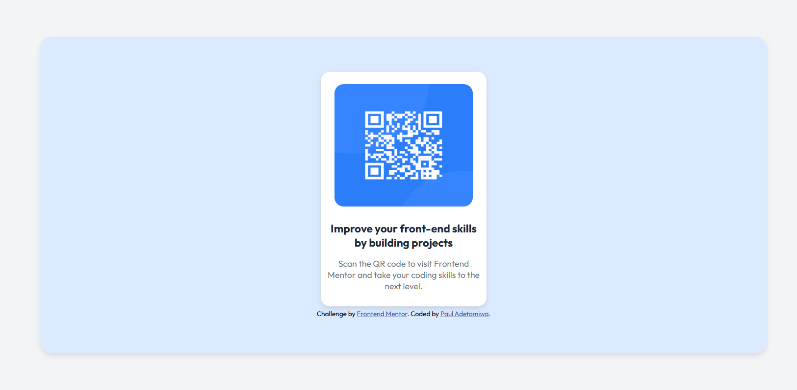

# Frontend Mentor - QR code component solution

This is a solution to the [QR code component challenge on Frontend Mentor](https://www.frontendmentor.io/challenges/qr-code-component-iux_sIO_H). Frontend Mentor challenges help you improve your coding skills by building realistic projects. 

## Table of contents

- [Overview](#overview)
  - [Screenshot](#screenshot)
  - [Links](#links)
- [My process](#my-process)
  - [Built with](#built-with)
  - [What I learned](#what-i-learned)
- [Author](#author)


## Overview

- This is a solution to a QR code component challenge on Frontend Mentor. Involves using HTML and CSS only to create a webpage of a QR code component. 

### Screenshot



### Links

- https://github.com/PaulAdetomiwa/qr-code-component/blob/main/index.html

## My process

### Built with

- Semantic HTML5 markup
- CSS custom properties
- Flexbox
- CSS Grid

### What I learned

```html
<link href="https://fonts.googleapis.com/css2?family=Outfit:wght@400;700&display=swap" rel="stylesheet">
```
- I learned how to use links to add fonts to a webpage.

```css
.container {
          font-family: 'Outfit', sans-serif;
}
```
- Using internal css, the font was applied to a specific container.

## Author

- Website - [Paul Adetomiwa](https://github.com/PaulAdetomiwa)
- Frontend Mentor - [@PaulAdetomiwa](https://www.frontendmentor.io/profile/PaulAdetomiwa)
- X - [@AdewolePaul6](https://www.x.com/AdewolePaul6)